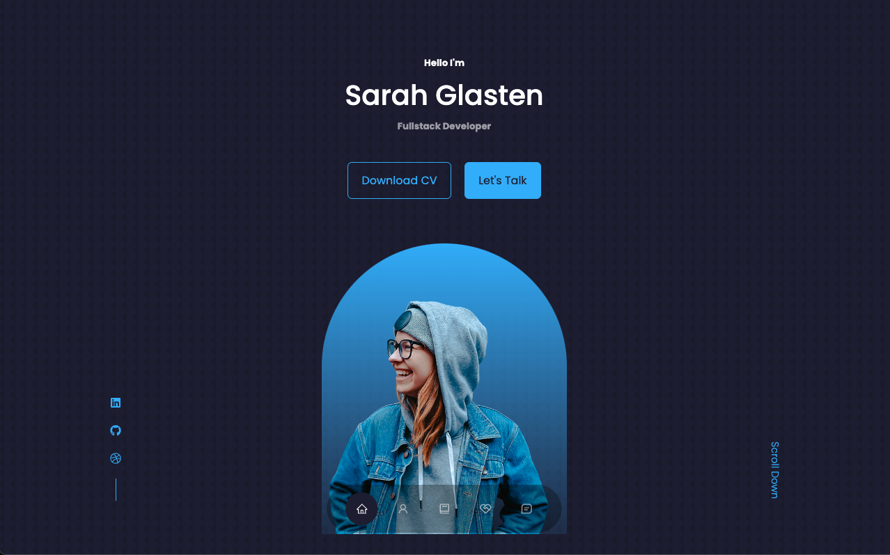
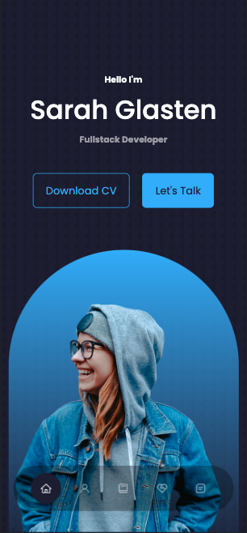

# Responsive Website using React

This is a simple portfolio site made with React. There are 6 individual components that make up the entire site. The icons were pulled from [react-icons](https://react-icons.github.io/react-icons). To make things more realistic I make it so you can download the resume. Overall this project was fun to build and I learned more about React because of it.

---

## Have a project you want to collaborate on or you just want to chat? You can contact me through either method below:

    
  &nbsp;
  &nbsp;
  &nbsp;
  
  
  <h2>Talk to you soon!</h2>

